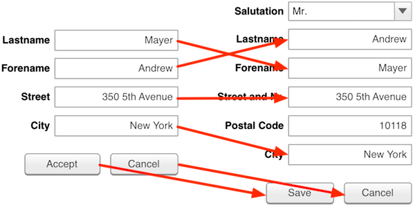
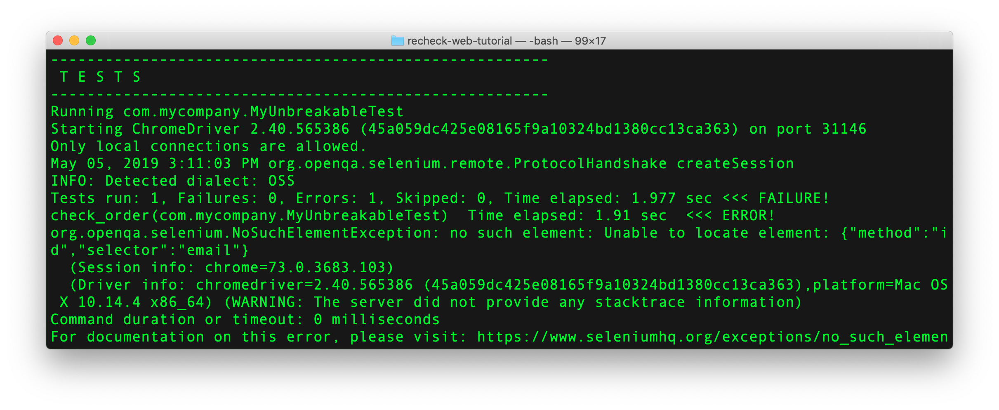

# Postponing Test Breakage

[Element identification is a well-known problem](element-identification-problem.md) for test automation engineers. recheck addresses this problem in an interesting and unique way. The Golden Master-based Difference Testing approach brings various benefits with it: it basically saves a complete copy of the last working state. Now after a breaking change, that copy can be used as a reference and for comparison. Now, e.g. if the label was used for identification, and the label changed, we can simply have a look in the old version (the Golden Master) and see which element has the given label. Then, using other identifying attributes like its XPath, ID, name, class and others, we can find the corresponding element with a different label in the current state. It is even better: not only do we have redundant information that we can easily keep up to date, thanks to the recheck.cli We also have a much more complete picture, i.e. all other elements that were on the website in the previous state. This allows for an easy 1-on-1 assignment of all elements, enabling a very robust element identification.



To use this functionality, we can simply change an [explicit checking test](tutorial/explicit-checks.md) in the following way:

```
private RecheckDriver driver;
private RecheckWebImpl re;

@Before
public void setUp() {
	re = new RecheckWebImpl();
	driver = new RecheckDriver( new ChromeDriver() );
}
```

Now instead of using the regular generic `RecheckImpl`, we use an adapted `RecheckWebImpl` and wrap the regular Selenium driver into a special `RecheckDriver`, that also is an instance of `RemoteWebDriver`. This way, maximal compatibility to other third party tools and test frameworks is ensured. Next, we can create a test that shows the functionality.

For that we can use an example page from the Selenium project itself. We can download the [`formPage.html`](https://github.com/SeleniumHQ/selenium/blob/master/common/src/web/formPage.html) from the [Selenium GitHub](https://github.com/SeleniumHQ/selenium) repository. Save it into your test resources folder (`src/test/resources`) Let‘s create a matching test for it. It could look like so:

```
public class MyUnbreakableTest {

	RecheckDriver driver;

	@Before
	public void setup() {
		driver = new RecheckDriver( new ChromeDriver() );
	}

	@Test
	public void check_order() throws Exception {
		driver.startTest();
		String url = Paths.get( "src/test/resources/formPage.html" ).toUri().toURL().toString();
		driver.get(url);

		driver.findElement(By.id("email")).sendKeys("Max");
		driver.findElement(By.id("age")).sendKeys("16");
		driver.findElement(By.name("login")).submit();

		driver.capTest();
	}

	@After
	public void tearDown() {
		driver.quit();
	}
}
```

Now we execute this test twice (using e.g. `mvn test`). The first execution will fail as there is no Golden Master to compare against, but recheck will create the Golden Master while doing so. The second time we execute this test, it should pass.

We then want to edit the HTML code of the page and change the used identifiers of the elements the test interacts with. So, we edit the `formPage.html` file and change the lines 15–19 from

```
<form method="get" action="resultPage.html" name="login">
    <input type="email" id="email"/>
    <input type="number" id="age"/>
    <input type="submit" id="submitButton" value="Hello there"/>
</form>
```

to something like 

```
<form method="get" action="resultPage.html" name="newLoginName">
    <input type="email" id="userEmail"/>
    <input type="number" id="numberOfLifeYears"/>
    <input type="submit" id="submit" value="Hello there"/>
</form>
```

Because these identifiers are used in the test, this would tip of a typical Selenium test and make it fail without an actual problem in the web site—what is usually referred to as “breaking the test”. To showcase and verify this problem, we can simply change the used driver to the default `ChromeDriver` and comment out the recheck-specific `capTest()` and `cap()` method calls (using `//`). Executing this test with a quick `mvn test -Dtest=MyUnbreakableTest` results in the dreaded `NoSuchElementException`.



Now let’s redo this with our original test using the `RecheckDriver` and execute it. It will still fail, but this time due to differences in the checks (as you would expect) and not due to elements not being found anymore. You can verify this by simply ignoring all differences. To do so, edit the `.retest/recheck.ignore` file and add `attribute-regex=.*`. This will ignore all attribute changes, including changes to `id` and `name`. If you re-execute your test, it will now pass.

However, if you have a closer look to the log output that is printed to the console during execution, you can see that it will now contain a message similar to the following:

```
*************** recheck warning ***************
The HTML name attribute used for element identification changed from 'login' to 'newLoginName'.
retest identified the element based on the persisted Golden Master.
If you apply these changes to the Golden Master , your test com.mycompany.MyUnbreakableTest will break.
Use the `By.name("newLoginName")` or `By.retestId("form")` to update your test MyUnbreakableTest.java:30.
```

This means that the `RecheckDriver` catched the `NoSuchElementException`. It then loaded the persisted Golden Master and found the element within there on the basis of the old version. Then it created the 1-on-1 assignment as shown above and was able to correctly associate the new with the old element. Then it just used the new element in the test and continued. However, if you now apply that change to the Golden Master, recheck will then not be able to identify the element based on the outdated identification criteria anymore. So, you have to update your test when you apply the change—or else it will break then.
