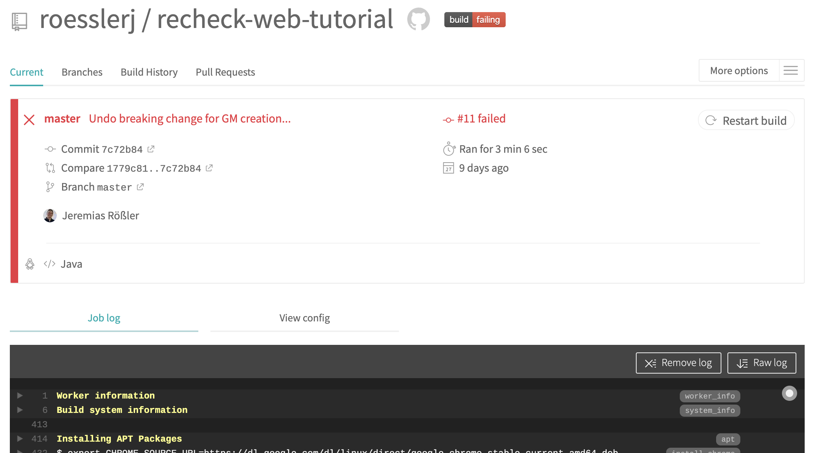

# Execute the Test on a CI Server

The simplest way to execute our existing test case in a CI/CD environment is a combination of GitHub and Travis. Follow the [previous description](using-git-and-github.md), in order to manage your project with Git and push it to GitHub.

Now we create an account with Travis at [travis-ci.com](https://travis-ci.com/). Travis is a CI/CD service provider that is free to use for open source projects. Once we log in using our existing GitHub account, we can see our GitHub repository. In order to have Travis execute our test case, we just need to add a `.travis.yml` text file (note the leading dot) with the following content:

```
language: java
dist: trusty

addons:
  chrome: stable
  firefox: stable
  apt:
    packages:
      - chromium-chromedriver

notifications:
  email: false

cache:
  directories:
    - "${HOME}/.m2/"

install: true

before_script:
  GECKODRIVER_VERSION="v0.24.0"
  GECKODRIVER_HASH="7552b85e43973c84763e212af7cca566"

  # include ChromeDriver in PATH
  - ln --symbolic /usr/lib/chromium-browser/chromedriver "${HOME}/bin/chromedriver"
  # start Chrome and listen on localhost
  - google-chrome-stable --headless --disable-gpu --remote-debugging-port=9222 http://localhost &
  # include GeckoDriver in PATH
  - wget --quiet https://github.com/mozilla/geckodriver/releases/download/${GECKODRIVER_VERSION}/geckodriver-${GECKODRIVER_VERSION}-linux64.tar.gz
  - echo ${GECKODRIVER_HASH} "geckodriver-${GECKODRIVER_VERSION}-linux64.tar.gz" | md5sum --check -
  - tar xf "geckodriver-${GECKODRIVER_VERSION}-linux64.tar.gz" -C ${HOME}/bin/

script: mvn clean verify
```

This file contains a simple configuration in YAML format, which tells Travis that we have a Java project that we want to build on a Ubuntu (Trusty) system. It also says that we want Chrome and Firefox with ChromeDriver and GeckoDriver installed and in our path. Once we add this file with `git add .travis.yml`, commit with `git commit -m "add .travis.yml"` and upload it to GitHub with `git push`, we should see our Travis build fire up.

Now we need to remove the following lines from our tests:

```
System.setProperty("webdriver.chrome.driver", "chromedriver");
System.setProperty("webdriver.gecko.driver", "geckodriver");
```

As of the Travis configuration, the ChromeDriver and GeckoDriver is now on the path and thus its location does not need to be set explicitly. Once we again commit and push, the tests are now executed on the Travis.


 
As you can see in the screenshot, the build fails because the test is now executed on a different operating system and a different device, revealing cross-device differences. Likewise, you can execute the test with a different browser, which would reveal cross-browser differences.

You can create [rules to ignore these differences in a more sophisticated way](rule-based-ignore.md).

