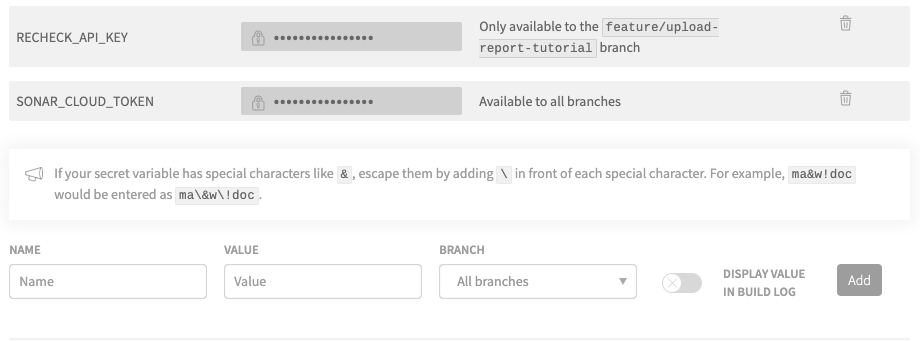

# Upload Test Reports to rehub

## Local Settings

Test reports can be easily uploaded to [***rehub***](https://retest.de/rehub/). For this our existing test case have to be adjusted only slightly. It is possible to upload test reports when we execute the test locally or in a CI/CD enviroment. For the configuration of the CI/CD enviroment follow [***this description***](travis-execute-ci.md), in order to execute your test with Travis.

To upload the reports you will need a [***retest account***](https://sso.prod.cloud.retest.org/auth/realms/customer/protocol/openid-connect/auth?response_type=code&client_id=garkbit&redirect_uri=http%3A%2F%2Fgarkbit.prod.cloud.retest.org%2Fsso%2Flogin&state=512ba44f-b51e-460b-80af-fc0964f1909e&login=true&scope=openid) to gain access to your repository service. After registration you will receive a 14-day trial.

Now we need to modify the `setUp()` method in our existing test case to enable the upload to rehub, we have two ways to do this:

- by setting up the `REHUB_REPORT_UPLOAD_ENABLED` system property

```java
@Before
void setUp() {
    driver = new ChromeDriver();
    re = new RecheckImpl();
    System.setProperty( Properties.REHUB_REPORT_UPLOAD_ENABLED, "true" );
}
```

- or by modify the `RecheckImpl` constructor

```java
@Before
void setUp() {
    driver = new ChromeDriver();
    re = new RecheckImpl( RecheckOptions.builder().reportUploadEnabled( true ).build() );
}
```

If we execute the test locally and the configuration was successful, our browser will pop up and we will be prompted to login, then we can find our test reports on the ***rehub garkbit***.

## Setup for Travis CI

After we have modified our existing test case, we should also configure our CI/CD environment. We need the `RECHECK_API_KEY` that is generated when the modified test is executed. We can read it from the log.

Start by configuring Travis CI with `RECHECK_API_KEY`. It can be set via your [***Travis CI environment variables in settings for a repository***](https://docs.travis-ci.com/user/environment-variables/#defining-variables-in-repository-settings). In your Travis repository go to Settings > Environment Variables.



The `RECHECK_API_KEY` is valid for individual and for all branches. 

>Keep your RECHECK_API_KEY token secret  <br/> 
>Anyone with access to your token can add test reports to your ***rehub garkbit***. <br/>
>For Travis-CI, make sure the `Display value in build log` toggle is off.

When we have completed all settings and executed the test in our CI/CD environment, we should receive the message `Sucessfully uploaded report to rehub` in the Travis CI Job Log. Now that the test has been executed in the CI/CD environment and the test report has been uploaded to rehub, we can maintain the report in different ways.

## Maintain a Report from rehub

We open our browser and visit the [***rehub garkbit***](https://garkbit.prod.cloud.retest.org/dashboard) website, we select a report and download it. Now we can maintain the report with [***review***](https://retest.de/review/) or the open-source tool [***recheck.cli***](https://github.com/retest/recheck.cli/). With the Review application it is also possible to load a report directly from the ***rehub garkbit*** and maintain it in ***review***.