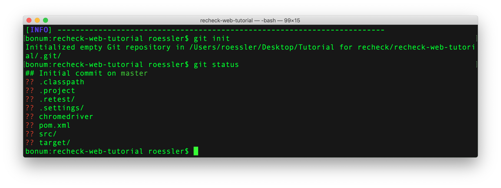
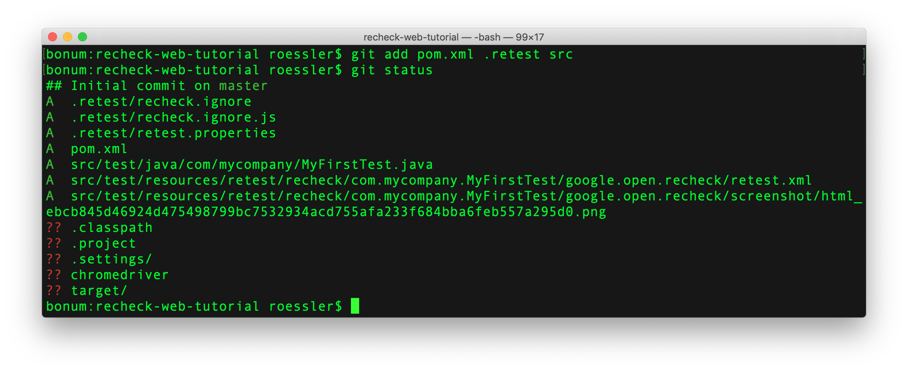

# Using Git and GitHub

Let us use Git as version control system. In combination with GitHub as central repository, we can also manage versions of test cases on different machines, thus also deploying our project to the server. So, using a test case, e.g. from the [tutorial](explicit-checks.md), we simply open a CMD in the corresponding folder and do a `git init`. This initializes the Git repository. You can call `git status` to see which files were added or changed in that directory.


 
We can add existing files, e.g. from the tutorial. We can simply call `git add pom.xml .retest src`. This will add the `pom.xml` file together with the `.retest` and `src` folder and all of its subfolders. It should result in an output similar to the following.


 
The remainder of the files, we do not want in our Git repository. `.classpath`, `.project` and `.settings` are generated by Eclipse. The `target` folder contains the artifacts generated by Maven from the source code. These are all volatile and derived artifacts, for which we do not want to track changes. The `chromedriver` executable, that can be seen in the output in the screenshot is a binary and system dependent file. We also do not want to add it to our repository. Like we did with recheck in the last tutorial, we need to ignore irrelevant differences. Similar to recheck, you only need to edit a single file. We can create a simple text file and name it `.gitignore`. To that file we add the following:

```
.classpath
.project
.settings/
target/
chromedriver
```

If we call `git status` again, we see that only the `.gitignore` file itself is marked as an added file. We add it to Git using `git add .gitignore` and commit the initial status with `git commit -m "Initial state"`.

In order to execute the test in a CI/CD environment, we need to create a GitHub account on [github.com](https://github.com/). GitHub is a code sharing service, that easily lets you collaborate on open source projects. Then we create a repository with the same name as our project and push our current status to that repository. To tell our local repository which remote repository to use, we call `git remote add origin https://github.com/yourusername/newrepo.git`. Then call `git push -f` to push it to that repository and overwrite any initial commits that GitHub did for us.
