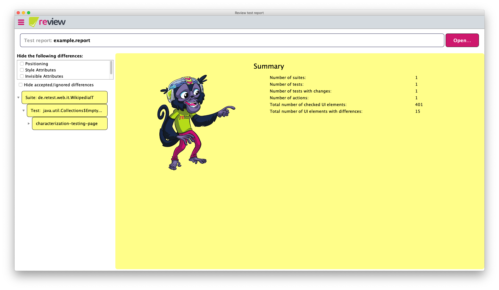
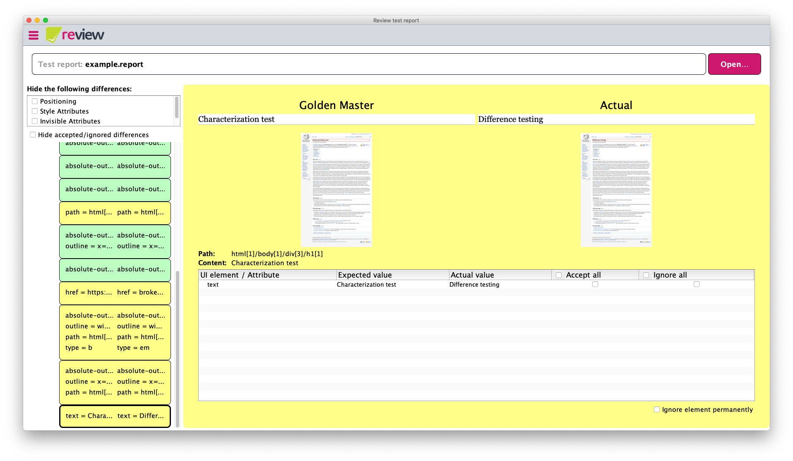

# Reports

## Open Reports

You can open reports from two perspectives: 

First is from the starting page with the `Open...` button in the middle of the page. 

Second is from the review reports page, which you can access over the menu or while having another report open. In the top right corner next to the head bar that shows the location of the current report is another `Open...` button. 

A window should pop up asking you to choose the report you want to open and shows the last 10 reports from ***rehub***. If you don't see them, but can only search for local reports, the login either did not work or you got logged out. You can open the menu on the burger icon in the top left corner and click on `Open Account...`. If you've logged in there, reopen ***review*** and your reports should appear. You can always search for reports locally if you downloaded them by clicking on `Open local file`.

## Maintaining the Golden Master

After opening a test report with an existing Golden Master you can view all differences between the actual version and the Golden Master. Yellow means there are changes you didn't accept or ignore yet and green means you did.

The differences are sorted by tests in suites. Those contain every single element that changed. By clicking on the test a table appears with all the changes. If you don't have a license there will be only 3 columns: `UI element / Attribute`, `Expected value` and `Actual value`. When there is a 4th and 5th column to accept and ignore changes but you can't click them, the Golden Master file is missing. Both error messages should be displayed right above the table on the right side. 

If everything is set up correctly you can either accept/ignore all of them at once by clicking the check mark in the head row or go through them individually. 

You can click on the screenshots to open them in a new window and view them in a larger resolution.
After you are done maintaining your Golden Master and accepted/ignored all the elements you wanted to, click on `Accept Changes` on the bottom. This button will only appear if you did at least one change.
This will update the Golden Master and/or the recheck.ignore file automatically and there should nothing be left you have to do.

## 1-click Test Maintenance

When accepting or ignoring differences, ***review*** will look through all checks for the same difference on the same element, cutting down the time to maintain the Golden Master significantly.

This is especially helpful if you performed multiple tests on the same website (e.g. using multiple resolutions, cross-browser, &hellip;) or different websites that share similar elements (e.g. header, footer, &hellip;). If a difference was detected on a shared element (e.g. a login button was changed), ***review*** will accept this difference across all performed checks.

## Ignore Elements

In the top left corner of the test report, above the navigation for the differences is a box with check marks for different type of elements. By using them you automatically ignore all elements of that type. Below that box is another check mark to filter every accepted/ignored (green) elements from the navigation tree. If you want to manage your ignores manually you can do so by configuring the [`retest.ignore` file](../../recheck-web/tutorial/setup-recheck.ignore.md) in your favorite text editor.

## Using review with free license

If you did not purchase a standard or higher license yet, some functionalities are not available in the free license:

1. You cannot accept or ignore changes directly in the GUI. The checkboxes are hidden, but if you wish to maintain your Golden Master you can still use the [***recheck.cli***](https://docs.retest.de/recheck.cli/setup/) which is entirely free.

2. You cannot open local files. The "Open local file"-Button will be disabled, file association and starting review over the terminal via `review path/to/tests.report` will not load the passed report.

## Logout

If you want to logout from review to maybe change accounts or so, you can only do so by going to [`Sessions` in `Your account` on ***rehub***](https://sso.prod.cloud.retest.org/auth/realms/customer/account/sessions) and click on `Log out all sessions`.
